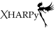

XHARPy
======

**XHARPy** (X-ray diffraction data Hirshfeld Atom Refinement in Python) is a pure Python
library that enables refinement with custom atomic form factors from various 
sources.

This is the first refinement library to implement the calculation of atomic form
factors from periodic PAW-DFT calculations. Additionally, there are experimental
implementations of atomic form factor determinations with Quantum Espresso, 
NoSpherA2/Orca and the possibility to refine against .tsc files.
Independent atom model for comparison and debugging is also available.

The library has been written with extensibility in mind. You can look at the 
f0j_sources folder for examples how to write a new atomic form factor source. If
you want to develop without touching the library itself you can have a look 
at the custom\_function\_source, This source exposes the functions, that are 
called during the refinement.

Refinement itself relies heavily on JAX for the automatic generation of 
gradients. This means that new features only have to be implemented in the loss
function. No explicit gradients are needed. 

If you have used the library in your research, please cite the paper where it
was originally published:

Ruth, P.N., Herbst-Irmer, R. & Stalke, D. (2022). *IUCrJ*,  **9**, 286-297. `https://doi.org/10.1107/S2052252522001385 <https://doi.org/10.1107/S2052252522001385>`_

Creation of this library was only possible due the generous support of the 
`Research Training Group BENCh <https://bench.uni-goettingen.de>`_ at the University 
of Göttingen, which is funded by 
the Deutsche Forschungsgemeinschaft (DFG, German Research Foundation) - 389479699/GRK245

Documentation
-------------

An online version of the documentation is available at:

`https://xharpy.readthedocs.org <https://xharpy.readthedocs.org>`_

With the sphinx package and the sphinx-rtd-theme installed you can compile the 
documentation using ``make html`` in the doc directory. 

Prerequisites
-------------

The following packages in the following versions were used for development
 - python = 3.8.12
 - `numpy <https://numpy.org/>`_ = 1.20.3
 - `scipy <https://scipy.org/>`_ = 1.7.3
 - `pandas <https://pandas.pydata.org/>`_ = 1.3.5
 - `jax <https://jax.readthedocs.io/>`_ = 0.2.26

For atomic form factor calculation in GPAW
 - `gpaw <https://wiki.fysik.dtu.dk/gpaw/>`_ = 21.6.0

For atomic form factor calculation in Quantum Espresso (experimental)
 - `qe <https://www.quantum-espresso.org/>`_ = 7.0

For difference electron density calculation
 - `cctbx <https://cci.lbl.gov/cctbx_docs/index.html>`_ = 2021.11

This does not mean, that the library will not work with other versions. I tried
not to use the newest of features, but I do not have the means/time to test how
much older or newer the versions can be before things start to break.

